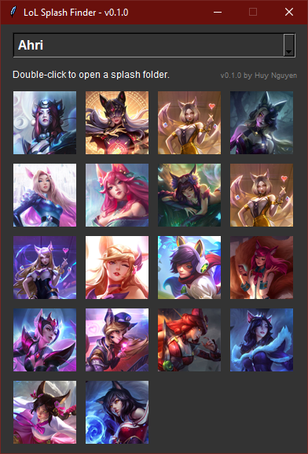
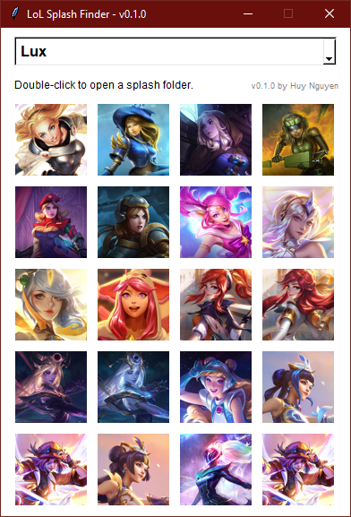

# LoL Splash Finder



## Overview

LoL Splash Finder is a crude Python script I made to practice programming. Its primary purpose is to aid League developers in quickly navigating and opening champion splash art folders.

⚠️ **Note: If you are not a League developer, this tool will not have any practical use for you.**

## Features

- **Champion and Skin Selection**: Select a champion from the dropdown menu and view all available skins.

- **Skin Thumbnail**: Display skin thumbnails for easy identification.

- **File Explorer Integration**: Open the selected skin's splash art folder with just one click.

- **Customizable**: Customize the tool's behavior with configuration options.

## Getting Started

### Prerequisites

Ensure you have the following dependencies installed:

- Python 3.x
- Pillow (PIL)

Install Pillow using:

```bash
pip install Pillow
```

### Installation

No install needed, just download the `LoLSplashFinder.py` file and run it.

## Configuration

The tool supports configuration through the `config.ini` file. A config file with default values will be generated on the first run. The configuration file includes the following options:

- **LoL Path**: Set the path to your League of Legends workspace in the `Paths` section.

- **App Theme**: Choose between "dark" and "light" themes in the `Settings` section.

- **Show Placeholder Skin**: Specify whether to show placeholder skins. A skin is considered a placeholder if its tile is smaller than 20 KB.

- **Reverse Display Order**: Control the order in which skins are displayed. Set to "True" for showing the newest skin first.

## License

This project is licensed under the MIT License - see the [LICENSE](LICENSE) file for details.

---

*This tool is not affiliated with or endorsed by Riot Games, Inc. League of Legends and Riot Games are trademarks or registered trademarks of Riot Games, Inc.*
